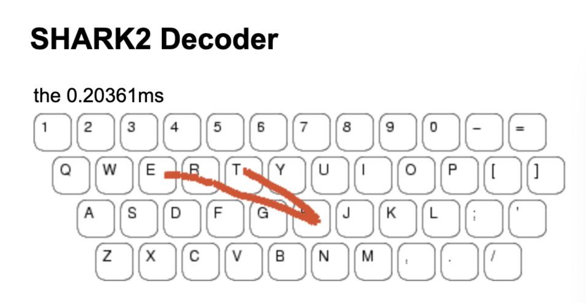

# Decode Sortahand Gesture on a virtual keyborad using the SHARK2(ShortHand Aided Rapid Keyboarding) algorithm

Given a dictionary containing 10000 words, implementation of SHARK2 algorithm (as in research paper: http://pokristensson.com/pubs/KristenssonZhaiUIST2004.pdf) to decode a user input gesture and output the best decoded word.

## Functions for implementation:
    1.Sampling
    2.Pruning
    3.Shape Channel
    4.Location Channel
    5.Integration

### Sampling

SHARK2 actually compares the user input pattern with standard templates for each word. When we compare different patterns, it is important to make them comparable. No matter how long or how short the gesture is, we uniformly sample 100 points along the pattern.
 
### Pruning

Start-to-start and end-to-end distances between each template and the unknown gesture is calculated. The two patterns should be normalized in scale and translation. Normalization is achieved by scaling the largest side of the bounding box to a parameter L.

**s = L/max(W,H)**

### Shape Channel

Shape score for every valid word after pruning is obtained. In this function, we compare the sampled input gesture (containing 100 points) with every single valid template (containing 100 points) and give each of them a shape score. This takes into account the relative coordinates of the gestures, thus the score is calculated after normalization.

### Location Channel

Location score for every valid word after pruning is obtained.  we compare the sampled input gesture (containing 100 points) with every single valid template (containing 100 points) and give each of them a location score. This takes into account the absolute coordinates of the gestures, thus normalization is not performed before calculating the score.

   
#### Integration score = a * shape score + b * location score where a and b are parameters and a + b = 1
   
### Get Best Word

Top-n words with the highest integration scores are selected and their corresponding probabilities are used as weight. The word with the highest weighted integration score is exactly the word we want.

_For example, integration_score(“too”) == integration_score(“to”), since prob(“too”) < prob(“to”), integration_score(“too”) * prob(“too”) < integration_score(“to”) * prob(“to”). Hence we choose word “to” and algorithm terminated._
 

 
